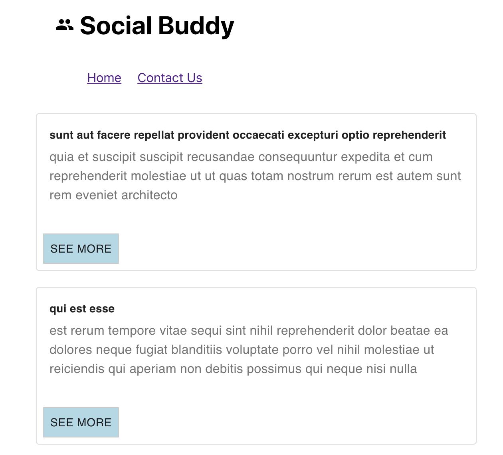
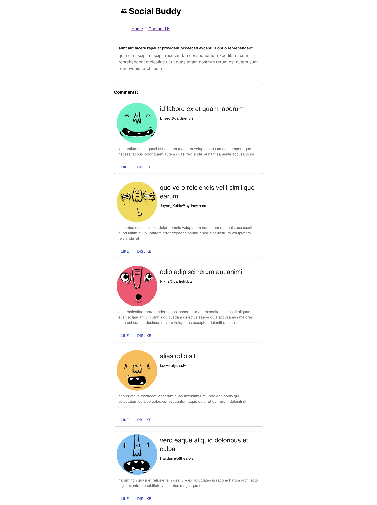

Social Buddy React Router Programming Hero React Web App

## Pages
Homepage

Comemnts Page

## Setup Instructions

1. Cd into project directory
2. run `npm install` to install packages.
3. run 'npm start` to run in localhost.

### `yarn start`

Runs the app in the development mode. 
Open [http://localhost:3000](http://localhost:3000) to view it in the browser.

The page will reload if you make edits. 
You will also see any lint errors in the console.

### `yarn test`

Launches the test runner in the interactive watch mode. 
See the section about [running tests](https://facebook.github.io/create-react-app/docs/running-tests) for more information.

### `yarn build`

Builds the app for production to the `build` folder. 
It correctly bundles React in production mode and optimizes the build for the best performance.

The build is minified and the filenames include the hashes. 
Your app is ready to be deployed!

Author: Md Rana Mahmud